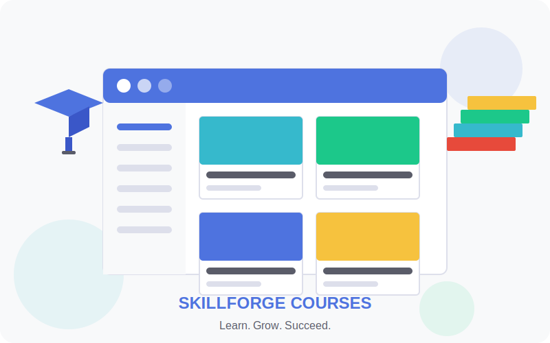

# SkillForge E-Learning Platform

<div align="center">
  
  <p><em>Learn from Industry Experts</em></p>

  [](https://www.oracle.com/java/technologies/java-ee-glance.html)
  [](https://getbootstrap.com/)
  [](https://www.mysql.com/)
</div>

## 📋 Overview

SkillForge is a modern e-learning platform designed to provide high-quality educational content from industry experts. The platform offers an intuitive interface for both learners and instructors, making knowledge sharing and skill acquisition more accessible.

<div align="center">
  
</div>

## 🚀 Project Status

### ✅ Completed Features

- **User Authentication**
  - Registration and login system
  - Role-based access control (Admin, Instructor, Student)
  - User profile management
  - Password hashing for security

- **Course Management**
  - Course creation and editing for instructors
  - Course listing and filtering
  - Course details page
  - Course thumbnails and media support

- **User Interface**
  - Responsive design for all devices
  - Modern dashboard for each user role
  - Navigation and dropdown menus
  - Profile management

- **Admin Features**
  - User management dashboard
  - User statistics and overview
  - Admin controls for platform management

### 🔄 In Progress

- **Content Management**
  - Lesson creation and management
  - Content blocks for different media types
  - Course curriculum organization

- **Student Experience**
  - Course enrollment functionality
  - Progress tracking
  - Course completion certificates

- **Instructor Tools**
  - Analytics for course performance
  - Student progress monitoring
  - Revenue tracking

### 📝 Planned Features

- **Advanced Content**
  - Interactive quizzes and assessments
  - Discussion forums for each course
  - Live sessions integration

- **Payment System**
  - Course purchasing
  - Subscription models
  - Instructor payouts

- **Social Features**
  - Student reviews and ratings
  - Social sharing
  - Community building tools

## 🛠️ Technology Stack

<div align="center">
  
</div>

- **Backend**: Java EE (Servlets, JSP)
- **Frontend**: HTML5, CSS3, JavaScript, Bootstrap 5
- **Database**: MySQL
- **Build Tool**: Maven
- **Server**: Apache Tomcat
- **Authentication**: Custom implementation with secure password hashing
- **Email**: Jakarta Mail API

## 🚀 Getting Started (For Beginners)

This section will guide you through setting up the SkillForge project on your local machine, even if you're new to web development.

### Prerequisites

Before you begin, make sure you have the following installed:

- **Java Development Kit (JDK) 11 or higher**
  - This is the foundation for running Java applications
  - [Download JDK from Oracle](https://www.oracle.com/java/technologies/javase-downloads.html)
  - After installation, verify by opening a terminal/command prompt and typing: `java -version`

- **Apache Maven 3.6+**
  - Maven is a build automation tool used for Java projects
  - [Download Maven](https://maven.apache.org/download.cgi)
  - [Installation Guide](https://maven.apache.org/install.html)
  - Verify installation with: `mvn -version`

- **MySQL 8.0+**
  - Our database system for storing all application data
  - [Download MySQL](https://dev.mysql.com/downloads/mysql/)
  - Remember the root password you set during installation!
  - Create a database named `skillforge` (You can do this later)

- **Apache Tomcat 9+**
  - The web server that will run our application
  - [Download Tomcat](https://tomcat.apache.org/download-90.cgi)
  - Extract the downloaded file to a location on your computer

### Step-by-Step Installation

1. **Clone the repository**:

   Open a terminal/command prompt and run:
   ```bash
   git clone https://github.com/v-eenay/skillforge-elearning.git
   cd skillforge-elearning
   ```

   This downloads the project code to your computer and navigates into the project folder.

2. **Configure the database**:

   - Open MySQL Workbench or your preferred MySQL client
   - Create a new database: `CREATE DATABASE skillforge;`
   - Create a user or use the root user (for development only)

3. **Configure the application**:

   - Copy the template configuration file:
     ```bash
     cp src/main/resources/config/application.properties.template src/main/resources/config/application.properties
     ```

   - Edit the new `application.properties` file with your database information:
     ```properties
     # Database connection properties
     db.driver=com.mysql.cj.jdbc.Driver
     db.url=jdbc:mysql://localhost:3306/skillforge
     db.username=your_db_username
     db.password=your_db_password
     ```

4. **Build the project**:

   Run this command in the project directory:
   ```bash
   mvn clean package
   ```

   This compiles the code and creates a deployable package. If successful, you'll see "BUILD SUCCESS".

5. **Deploy to Tomcat**:

   **Method 1: Manual deployment**
   - Copy the generated WAR file from the `target` directory to Tomcat's `webapps` directory
   - The WAR file will be named something like `skillforge.war`

   **Method 2: Using Maven (easier for beginners)**
   - Configure Tomcat in your Maven settings
   - Run: `mvn tomcat7:deploy`

6. **Start Tomcat**:

   - Navigate to Tomcat's `bin` directory
   - On Windows: Run `startup.bat`
   - On Mac/Linux: Run `./startup.sh`

7. **Access the application**:

   Open your browser and navigate to:
   ```
   http://localhost:8080/skillforge
   ```

   You should see the SkillForge homepage!

## ⚙️ Understanding the Project Structure (For Beginners)

<div align="center">
  
</div>

If you're new to web development, here's a simple explanation of how this project is organized:

### 📁 Project Structure

- **`src/main/java`**: Contains all the Java code
  - **`controllers`**: Handles user requests (like clicking a button)
  - **`models`**: Defines data structures (like User, Course)
  - **`dao`**: Database access code
  - **`services`**: Business logic
  - **`utils`**: Helper functions

- **`src/main/webapp`**: Contains web files
  - **`WEB-INF/views`**: JSP pages (the actual web pages)
  - **`assets`**: Static files like images, CSS, and JavaScript
  - **`common`**: Reusable components like headers and footers

- **`src/main/resources`**: Configuration files

### 🔄 How It Works

1. User makes a request (clicks a link/button)
2. A Servlet (controller) receives the request
3. The controller uses services to process the request
4. Services use DAOs to interact with the database
5. The controller forwards to a JSP page
6. The JSP page renders HTML to the user

## 🛠️ Configuration Details

### Database Setup

The application will automatically create the necessary tables if they don't exist. Just make sure you've created the database first:

```sql
CREATE DATABASE skillforge;
```

Then configure your database connection in `application.properties`:

```properties
# Database connection properties
db.driver=com.mysql.cj.jdbc.Driver
db.url=jdbc:mysql://localhost:3306/skillforge
db.username=your_db_username
db.password=your_db_password
```

### Email Configuration

To enable contact forms and notifications:

1. Configure the SMTP settings in `application.properties`:
   ```properties
   # Email configuration
   email.enabled=true
   email.smtp.host=smtp.gmail.com
   email.smtp.port=587
   email.username=your.email@gmail.com
   email.password=your-app-password
   email.from=your.email@gmail.com
   email.admin=admin.email@gmail.com
   ```

2. **For Gmail users**:
   - Enable 2-Step Verification on your Google account
   - Generate an App Password (this is different from your regular password)
   - Use the generated 16-character password in your configuration

### ⚠️ Security Note

Never commit the `application.properties` file to version control as it contains sensitive information. The file is already added to `.gitignore`.

## 🔍 Common Issues & Solutions

### Application Won't Start

1. **Check Tomcat logs**: Look in `[tomcat-directory]/logs` for error messages
2. **Verify database connection**: Make sure MySQL is running and credentials are correct
3. **Port conflicts**: Make sure nothing else is using port 8080

### Database Connection Issues

1. Verify MySQL is running: `mysql --version`
2. Try connecting manually: `mysql -u username -p`
3. Check your database exists: `SHOW DATABASES;`
4. Ensure user has proper permissions: `GRANT ALL PRIVILEGES ON skillforge.* TO 'username'@'localhost';`

### Login Problems

1. Default admin credentials (if set up): admin/admin123
2. If you can't log in, try registering a new account
3. Check the database to verify user accounts exist

## 🧪 Testing the Application

### Manual Testing

1. Register a new account
2. Log in with different user roles
3. Create and browse courses
4. Test responsive design on different devices

### Automated Testing

Run the automated tests with:

```bash
mvn test
```

## 👨‍💻 Contributors

**Vinay Koirala**
Lecturer, Itahari International College

### Contact

- Email: koiralavinay@gmail.com
- Academic Email: Binaya.koirala@iic.edu.np
- GitHub: [v-eenay/skillforge-elearning](https://github.com/v-eenay/skillforge-elearning.git)

## 🤝 How to Contribute

We welcome contributions! If you're a beginner:

1. Fork the repository
2. Create a feature branch: `git checkout -b my-new-feature`
3. Make your changes
4. Commit: `git commit -am 'Add some feature'`
5. Push: `git push origin my-new-feature`
6. Submit a Pull Request

<div align="center">
  
  <p><em>Happy Learning!</em></p>
</div>
